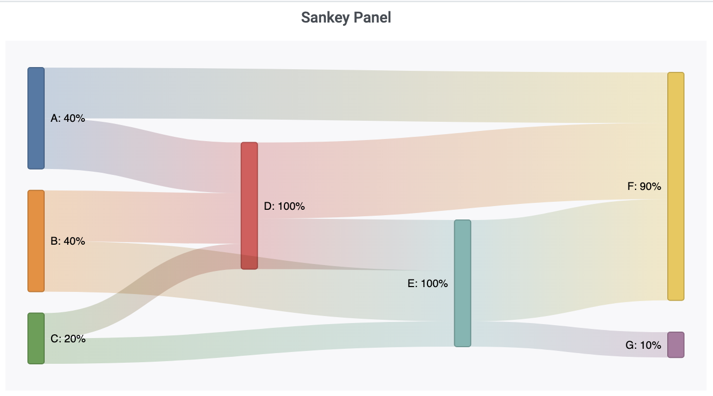

# Grafana Sankey Panel

Sankey diagram implementation for directed flow visualization between nodes in an acyclic network.



## Installing

Using the grafana-cli:

```bash
grafana-cli --pluginUrl https://github.com/IsmaelMasharo/sankey-panel/raw/master/sankey-panel.zip plugins install sankey-panel
```

## Grafana Version

Tested on Grafana 7.3.1

## Required Fields

The diagram gets constructed from a data source with 3 mandatory fields: *source* (text), *target* (text), *value* (numeric). Being an acyclic implementation of the Sankey diagram **loops are not allowed**. To avoid *circular link error* (a masked prefix)[https://github.com/IsmaelMasharo/sankey-panel/issues/1#issuecomment-757972917] could be set on the target values.

## API Reference

There are 5 options for displaying the diagram: *Alignment*, *Color*, *Edge Color*, *Display Values*, *Highlight Connections*

### Alignment

Arranges the nodes to one of the following sides: Left, Right, Center, Justify. See d3 (sankey nodeAlign)[https://github.com/d3/d3-sankey#alignments] for image reference.

### Color

Nodes and links color. Based on d3 (categorical schemes)[https://github.com/d3/d3-scale-chromatic#categorical].

### Edge Color

Represents the link's color transition from source to the target node.

- Input: Link takes the color of the source node.
- Output: Link takes the color of the target node.
- Input-Output: The link will be colored as a gradient from source to target node colors.
- None: Gray links.

### Display Values

Values are shown next to the node name.

- Total: Display link weight value.
- Percentage: Display link weight percentage value relative to the source.
- Both: Display both total and percentage.
- None: No values displayed (except for node name).

### Highlight Connections

Boolean. Highlights links and nodes with a direct connection to the hovered node.
